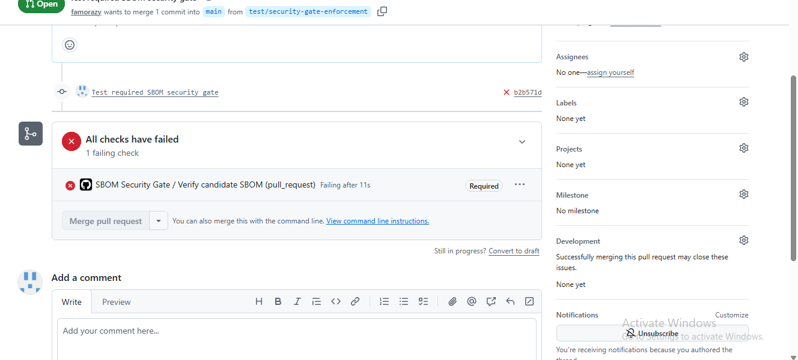

# Automated SBOM Security Gate and Branch Protection

## Objective

Implement an automated software supply-chain control that evaluates every pull request targeting the protected `main` branch and prevents vulnerable SBOM content from being merged.

## Automated Controls

- Verifies the SHA-256 integrity of committed CycloneDX SBOM files.
- Scans the repository for exposed secrets.
- Confirms that the vulnerable baseline SBOM is rejected.
- Requires the remediated candidate SBOM to contain no fixable High or Critical vulnerabilities.
- Runs automatically on every pull request targeting `main`.

## Branch Protection

The active GitHub ruleset applies the following controls to `main`:

- Changes must be submitted through a pull request.
- The `Verify candidate SBOM` status check must pass.
- Pull-request branches must be current with `main`.
- Force pushes are blocked.
- Deletion of the protected branch is restricted.
- No users or applications are included in the bypass list.

## Validation Results

| Test | Expected result | Actual result |
|---|---|---|
| Remediated SBOM workflow | Pass | Passed |
| Vulnerable SBOM substituted as candidate | Fail | Failed as expected |
| Merge attempt with failed required check | Blocked | Blocked |

## Enforcement Evidence

The failed check is marked `Required`, and the merge control is disabled. This demonstrates that the workflow is enforced as a repository policy rather than operating only as an informational scan.

## Limitations

- The workflow evaluates committed SBOM files; it does not rebuild the container image.
- SBOM files must be regenerated whenever the underlying image changes.
- Licence classifications require separate governance or legal review.

## Outcome

The repository now applies automated vulnerability detection, integrity checking, secret scanning and branch-level enforcement before changes can enter `main`.
