# Container Vulnerability Remediation and Docker Hardening Lab

**Author:** Oluwafemi Ajiboye  
**Focus:** Container vulnerability assessment, remediation validation and least-privilege runtime hardening

## Project overview

This project documents a controlled security assessment of a containerized Node.js OAuth API. I used Trivy to identify fixable High and Critical vulnerabilities, investigated their source, validated a remediated image and hardened the Docker runtime without breaking application health or access controls.

The result was a reduction from **7 fixable High/Critical findings to 0 under the same Trivy policy**, followed by runtime validation of a non-root user, zero effective Linux capabilities, a read-only root filesystem, seccomp filtering, resource limits, protected temporary storage and bounded log rotation.

## Verified outcome

| Area | Baseline | Hardened primary |
|---|---|---|
| Image | `securestock-oauth-api:1.0.0` | `securestock-oauth-api:1.0.1` |
| Trivy policy | Fixable High/Critical vulnerabilities | Same policy |
| Selected findings | 6 High, 1 Critical | 0 |
| Security-gate exit code | `1` — rejected | `0` — accepted |
| Runtime user | Not part of the vulnerability result | `node` (UID 1000) |
| Effective capabilities | Not part of the vulnerability result | `0000000000000000` |
| Root filesystem | Not part of the vulnerability result | Read-only and enforcement-tested |
| Seccomp | Not part of the vulnerability result | Filter mode active |
| Logging | Unlimited `json-file` configuration identified | Rotating `local` driver, 10 MB × 3 files |
| Functional test | Not applicable | `/health` returned HTTP 200 |
| Anonymous protected request | Not applicable | `/inventory` returned HTTP 401 |

After parallel validation on port `4002`, the primary service was recreated with the hardened controls and bounded logging configuration. Docker reported the replacement healthy on its original host port, `127.0.0.1:4001`.

> The zero result applies only to fixable High and Critical vulnerabilities selected by the documented scan policy. It is not a claim that the image contains no vulnerabilities of any severity.

## Investigation workflow

```mermaid
flowchart LR
    A[Scan baseline image] --> B[Identify 7 fixable High/Critical findings]
    B --> C[Trace findings to bundled npm tooling]
    C --> D[Remove unnecessary npm tooling from runtime image]
    D --> E[Rescan candidate with identical policy]
    E --> F[Security gate accepts candidate]
    F --> G[Apply least-privilege runtime controls]
    G --> H[Validate health and authorization]
```



## Technical findings

The operating-system package scan returned no selected High/Critical findings. The seven selected findings came from packages bundled with the global npm installation in the runtime image:

- `brace-expansion` 5.0.6: three High findings
- `ip-address` 10.2.0: one High finding
- `tar` 7.5.16: one Critical and one High finding
- `undici` 6.26.0: one High finding

The application dependency set under `app/node_modules` returned no selected findings under this policy. The remediated runtime retained Node.js v24.19.0 but no longer contained npm or the four affected npm subpackages. This reduced attack surface instead of carrying unnecessary build tooling into production.

## Runtime hardening controls

- Non-root `node` user
- Read-only root filesystem
- All Linux capabilities dropped
- `no-new-privileges` enabled
- Docker default seccomp filtering active
- PID limit of 100
- Memory limit of 256 MiB
- Combined memory-and-swap limit of 512 MiB
- CPU limit of one logical CPU
- Writable `/tmp` supplied through a 16 MiB `tmpfs` with `noexec` and `nosuid`
- Service published only on `127.0.0.1`
- Rotating Docker `local` logs limited to three 10 MB files
- Image health check retained and tested

The tested WSL kernel reported AppArmor as present but disabled, so this project does **not** claim AppArmor enforcement.

## Repository structure

```text
.
├── README.md
├── TECHNICAL_REPORT.md
├── PORTFOLIO_SUMMARY.md
├── compose.hardened.yaml
├── .env.example
├── .gitignore
├── evidence/
│   └── README.md
└── scripts/
    ├── trivy-security-gate.sh
    └── validate-hardening.sh
```

## Reproducing the security gate

Requirements:

- Linux or WSL2
- Docker Engine
- Trivy
- Both local images: `securestock-oauth-api:1.0.0` and `securestock-oauth-api:1.0.1`

Run:

```bash
chmod +x scripts/*.sh
./scripts/trivy-security-gate.sh
```

Expected result:

```text
Baseline 1.0.0 exit code: 1
Candidate 1.0.1 exit code: 0
RESULT: PASS - vulnerable baseline rejected; remediated candidate accepted.
```

## Running the hardened candidate

Create a local `.env` file from `.env.example` and insert lab-only values. Never commit `.env`.

```bash
cp .env.example .env
chmod 600 .env
sudo docker compose -f compose.hardened.yaml config --quiet
sudo docker compose -f compose.hardened.yaml up -d
```

Validate the running service:

```bash
CONTAINER_NAME=securestock-api HOST_PORT=4001 \
  ./scripts/validate-hardening.sh
```

## Evidence

The `evidence` directory is designed for redacted scan reports, configuration output and validation results. It must never contain OAuth credentials, JWT secrets, access tokens or raw environment-variable values.

See [evidence/README.md](evidence/README.md) for the evidence map.

## Limitations and next improvements

- AppArmor was disabled in the WSL host kernel and was not counted as an active control.
- OAuth and JWT secrets remain environment variables visible to users with privileged Docker access. A production design should retrieve secrets from a dedicated secret-management system or mounted secret files.
- Local HTTP was appropriate for the isolated lab. Production traffic requires TLS termination; HSTS has no protective effect over plain HTTP.
- The principal security gate intentionally covered fixable High/Critical vulnerabilities. Scheduled all-severity scans and review of unfixed findings should supplement it.
- Image tags are mutable. A production deployment should pin an approved image digest.

## References

- [Trivy container-image scanning](https://trivy.dev/docs/latest/guide/target/container_image/)
- [Docker runtime resource constraints](https://docs.docker.com/engine/containers/resource_constraints/)
- [Docker seccomp profiles](https://docs.docker.com/engine/security/seccomp/)
- [Docker AppArmor profiles](https://docs.docker.com/engine/security/apparmor/)
- [Docker local logging driver](https://docs.docker.com/engine/logging/drivers/local/)
